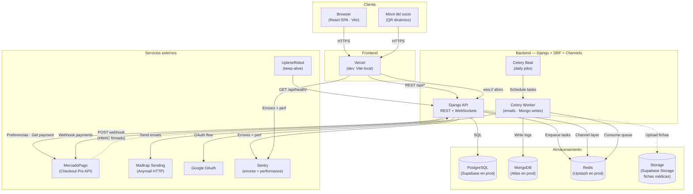

# Arquitectura del Sistema — Winnie The Gym

Vista de alto nivel de la infraestructura del proyecto. Cubre servicios, flujos de datos y dependencias externas.

**Documentos relacionados:**
- `docs/database/mer.md` — Modelo relacional PostgreSQL
- `docs/database/mongo-schemas.md` — Esquemas MongoDB
- `.atl/decisions/backend-mp-emails-reports.md` — Decisiones del bundle MP + emails + reportes
- `.atl/decisions/data-devops-hardening.md` — Decisiones del bundle actual

## Diagrama de componentes



## Servicios y responsabilidades

| Servicio | Rol | Local (dev) | Producción |
|---|---|---|---|
| **Frontend** | UI React SPA | Vite `:5173` | Vercel |
| **Backend Django + Channels** | API REST + WebSockets | Docker `:8000` | Render Web Service |
| **Celery Worker** | Tareas async (emails, Mongo, notif) | Docker | Render Worker |
| **Celery Beat** | Scheduler (job diario de vencimientos) | Docker | Render Worker |
| **PostgreSQL** | Fuente de verdad transaccional | Docker `:5432` | Supabase |
| **MongoDB** | Auditoría + historial QR | Docker `:27017` | MongoDB Atlas |
| **Redis** | Broker Celery + Channel Layer WS + Cache | Docker `:6379` | Upstash |
| **Storage** | Fichas médicas (PDFs/imágenes) | Local `MEDIA_ROOT` | Supabase Storage |
| **MercadoPago** | Pagos (Checkout Pro + webhook) | Sandbox | Sandbox / Producción |
| **Mailtrap** | Email API (Anymail HTTP) | Sending sandbox | Sending prod (dominio verificado) |
| **Google OAuth** | Login social | OAuth2 dev credentials | OAuth2 prod credentials |
| **Sentry** | Errores y performance | Opt-in | Opt-in |
| **UptimeRobot** | Keep-alive Render free | N/A | Ping cada 5 min a `/api/health/` |

## Flujos críticos

### 🔑 Autenticación (login)

```
Socio → Frontend → POST /api/auth/login/ (o /api/auth/google/)
Backend → Postgres (verify credentials) → JWT (access 30min + refresh 1d)
Frontend guarda JWT → todas las requests llevan Authorization: Bearer <token>
```

### 📱 Generación y validación de QR

```
1. Socio → GET /api/access/qr/generate/ → Backend firma JWT con TTL 30s → Frontend muestra QR

2. Recepcionista escanea → POST /api/access/qr/scan/
   Backend valida firma + expiración + estado membresía
   → INSERT AccessLog en Postgres
   → Enqueue Celery task log_qr_event → Worker → Mongo qr_history
   → Signal post_save(AccessLog) → Redis Channel Layer → broadcast aforo actualizado a todos los WS conectados

3. AforoMonitor (browser) recibe update en <500ms
```

### 💳 Pago con MercadoPago

```
1. Socio elige plan → POST /api/payments/preferencias/
   Backend crea Pago(pendiente) + POST a MP API → devuelve init_point
   Frontend redirige al checkout de MP

2. Socio paga en MP → MP redirige a back_url

3. MP dispara webhook → POST https://<backend>/api/payments/webhook/ (con header x-signature)
   Backend valida HMAC-SHA256 → GET payment desde MP → actualiza Pago
   → Si approved: renovar_membresia (activa vieja → vencida, crea nueva activa)
   → Enqueue email payment_confirmation → Celery → Mailtrap → Socio recibe email
```

### 📧 Job diario de vencimientos

```
09:00 ARG → Celery Beat dispara memberships.check_expiring_memberships
Task scanea Membresia activa con fecha_fin en {today+7, today+3, today+1, today}
Por cada match no dedup:
  → Enqueue email expiration_alert → Celery worker → Mailtrap → Socio
  → Actualiza Membresia.avisos_enviados
  → En day 0: flip estado a 'vencida'
```

## Deploy target (según wiki `Despliegue.md`)

```
Cliente ─── HTTPS ──────────────────→ Vercel (React SPA)
        └── HTTPS/REST ──────────────→ Render (Django API :8000)
        └── WSS ─────────────────────→ Render (Channels sobre ASGI)

Render Web    ├── PostgreSQL ────────→ Supabase (free 500MB)
              ├── Storage ───────────→ Supabase Storage (fichas médicas)
              ├── MongoDB ───────────→ MongoDB Atlas (free)
              ├── Redis ─────────────→ Upstash (free TLS)
              ├── Sentry ────────────→ Sentry Cloud (free)
              └── Mailtrap Sending ──→ Email API

UptimeRobot ── ping cada 5min ──→ Render /api/health/
```

Costo total: $0 en tiers gratuitos.

## Puntos críticos de infraestructura

### Render Free
- Duerme tras 15 min sin tráfico → **UptimeRobot** lo mantiene despierto
- Corta WebSockets inactivos a los 90s → **heartbeat** cliente cada 60s

### MercadoPago webhook
- Requiere URL pública → **dev**: `ngrok` con dominio fijo · **prod**: URL Render
- Idempotencia garantizada por `Pago.mp_payment_id UNIQUE`
- Firma HMAC-SHA256 v1 validada por `MP_WEBHOOK_SECRET`

### MongoDB Atlas
- Free tier tiene lag variable → escrituras a Mongo son **async vía Celery** (nunca bloquean el request)
- TTL indexes limpian docs > 90 días automáticamente

### Redis
- Se usa para 3 cosas: **broker Celery**, **channel layer WS**, **cache**
- Bases lógicas separadas: `/1` (Celery broker), `/2` (Celery backend), `/1` (Django cache)
