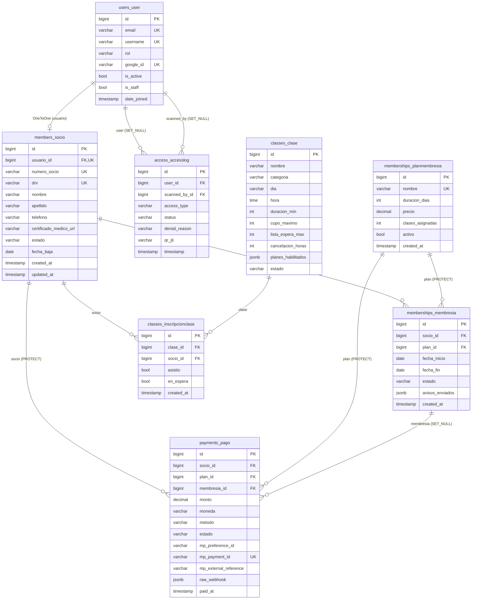

# Modelo Entidad-Relación (MER) — PostgreSQL

Fuente de verdad transaccional del sistema. Cubre 8 modelos con relaciones entre sí, superando el mínimo de 6 requerido por el ABP.

**Fuente del esquema:** `docs/database/schema.dbml` — editable en [dbdiagram.io](https://dbdiagram.io).

**Para regenerar la imagen exportable (PNG/SVG):**
1. Abrir [dbdiagram.io](https://dbdiagram.io)
2. Pegar el contenido de `docs/database/schema.dbml`
3. Menú superior → **Export** → PNG o SVG
4. Reemplazar `docs/database/mer.png` (o `.svg`) en el repo

## Diagrama (Mermaid — se renderiza en GitHub)

## Descripción de relaciones

### 1 · Usuario ↔ Socio (OneToOne)
- `members_socio.usuario_id` → `users_user.id` (`unique=True`, `on_delete=CASCADE`)
- Un `User` con `rol='socio'` **puede** tener un perfil de `Socio`. La propiedad `User.is_profile_complete` devuelve `True` cuando existe la relación.

### 2 · Socio 1..N Membresías
- `memberships_membresia.socio_id` → `members_socio.id` (`on_delete=CASCADE`)
- Un socio acumula histórico de membresías. La activa es la de mayor `fecha_inicio` con `estado='activa'`.
- El servicio `renovar_membresia()` transiciona las membresías activas anteriores a `vencida` de forma transaccional.

### 3 · Plan 1..N Membresías
- `memberships_membresia.plan_id` → `memberships_planmembresia.id` (`on_delete=PROTECT`)
- Un plan no puede eliminarse si tiene membresías asociadas — se archiva con `activo=False`.

### 4 · Socio + Plan → Pago (PROTECT)
- `payments_pago.socio_id` y `payments_pago.plan_id` con `PROTECT` para preservar el historial contable.
- `payments_pago.membresia_id` con `SET_NULL` porque en escenarios de reembolso la membresía asociada puede limpiarse pero el registro contable persiste.

### 5 · Idempotencia del webhook MP
- `payments_pago.mp_payment_id` es `UNIQUE`. Cuando MercadoPago reenvía el mismo webhook (garantía at-least-once), el segundo `INSERT` colisiona y se ignora.
- `payments_pago.mp_external_reference` es indexado para búsqueda rápida en la fase de webhook (antes de tener el `mp_payment_id`).

### 6 · Clase 1..N Inscripciones
- `classes_inscripcionclase.clase_id` → `classes_clase.id` (`on_delete=CASCADE`)
- Único por `(clase, socio)` — un socio no puede inscribirse dos veces a la misma clase.
- El campo `en_espera` diferencia cupos confirmados vs lista de espera.

### 7 · AccessLog (log relacional de accesos)
- `access_accesslog.user_id` con `SET_NULL` para conservar el evento aunque el usuario se elimine (auditoría inmutable).
- `access_accesslog.scanned_by_id` idem — separado del socio para trazar qué operador escaneó.
- Cada `AccessLog` se replica de forma asíncrona en `qr_history` (MongoDB) para análisis histórico sin degradar el core transaccional. Ver `docs/database/mongo-schemas.md`.

## Índices

| Índice | Tabla | Motivo |
|---|---|---|
| `memberships_socio_e_idx` | `memberships_membresia (socio_id, estado)` | Query frecuente: "membresía activa del socio X" |
| `pagos_socio_e_idx` | `payments_pago (socio_id, estado)` | Listado histórico de pagos del socio filtrado por estado |
| `pagos_extref_idx` | `payments_pago (mp_external_reference)` | Lookup en el webhook antes de tener `mp_payment_id` |
| `inscripcion_unica` | `classes_inscripcionclase (clase_id, socio_id)` UNIQUE | Impide inscripciones duplicadas |
| `access_accesslog.timestamp` | `access_accesslog` | Orden desc para listados recientes |
| `access_accesslog.qr_jti` | `access_accesslog` | Anti-replay: buscar si un JTI ya fue consumido |

## Convenciones aplicadas

- **Nomenclatura**: dominio en español (`Socio`, `Membresia`, `Clase`), infra en inglés
- **Estados**: `TextChoices` internas del modelo con valores snake_case español
- **FKs cross-app**: string form (`'members.Socio'`) — **ADR-7**
- **Timestamps**: `created_at` + `updated_at` en todos los modelos mutables
- **BigAutoField** por default (Django 5)
